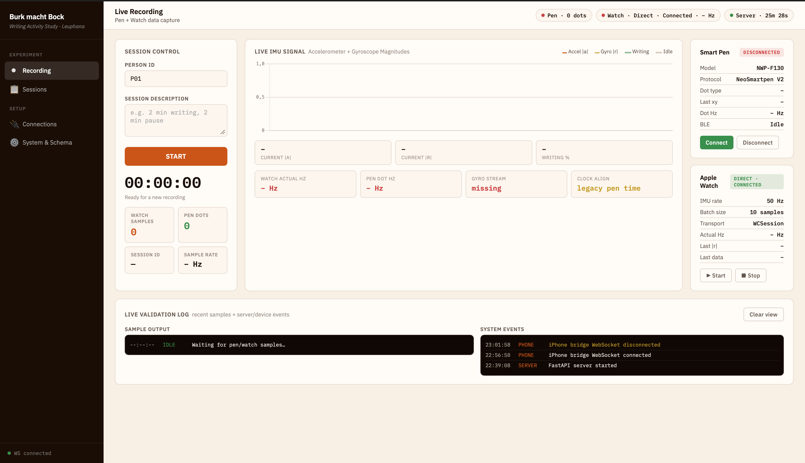
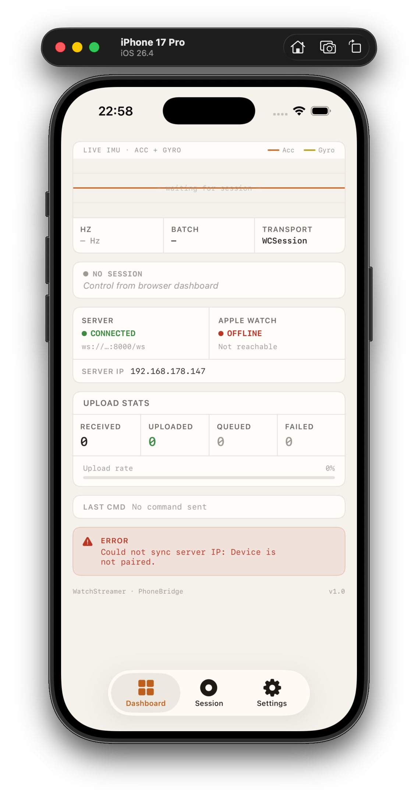
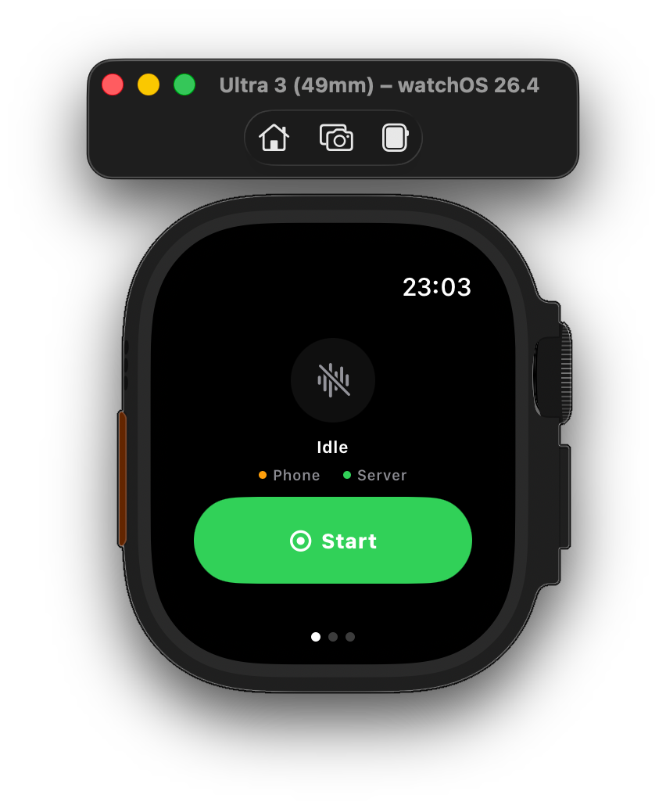

# Writing Activity Detection via Apple Watch IMU

**Semester project · Machine Learning for Smart and Connected Systems**  
Team: Noah Samel · Ben Kriegsmann · Tajuddin Snasni

---

## Research Question

> Can writing activity be detected and predicted from IMU data (accelerometer + gyroscope) of an Apple Watch?

The Moleskine Smart Pen acts as ground truth during data collection: its stroke events label each watch sample in time. Once the model is trained, the pen is no longer needed — inference runs on watch data alone.

---

## How it works

```
Apple Watch (50 Hz IMU)
  └─ WatchConnectivity ──► iPhone Bridge ──► POST /watch ──► server.py
                                                                  │
Moleskine Smart Pen (BLE, ~85 Hz)                                 │
  └─ pen_logger.py ────────────────────────────────────────────────┘
                                                                  │
                                              data/raw/watch/{session}_watch.csv
                                              data/raw/pen/{session}_pen.csv
                                                                  │
                                              src/preprocessing/preprocessing.py
                                              (nearest-neighbour join ±20 ms)
                                                                  │
                                              data/processed/merged_dataset.csv
                                                                  │
                                              src/training/train.py
                                              src/evaluation/evaluate.py
```

---

## Screenshots

### Dashboard (Web)

The session dashboard runs at `http://localhost:8000` and gives a real-time view of both sensors, session management, and data quality.

**Session overview & live sensor status**



**Sessions page with quality scores**


**Session validation / timeline detail**


---

### iPhone App

The iPhone app bridges Watch ↔ Server: it receives IMU batches via WatchConnectivity and forwards them as HTTP POSTs. It also relays start/stop commands from the server to the Watch.



---

### Apple Watch App

The Watch app captures `CMDeviceMotion` at 50 Hz and streams batches of 10 samples to the iPhone bridge. The UI shows session state, sample rate, and connection status.



---

> **Adding screenshots:** drop PNG files into `docs/screenshots/` with the filenames above, then commit. GitHub renders them automatically.

---

## Hardware

| Device | Role | Data |
|--------|------|------|
| Apple Watch (Series 6+) | Model input | Accelerometer + Gyroscope @ 50 Hz |
| Moleskine Smart Pen NWP-F130 | Ground truth | x/y/pressure/dot_type @ ~85 Hz via BLE |

---

## Project Structure

```
server.py                        FastAPI entry point (thin, ~44 lines)
pen_logger.py                    BLE logger for the Moleskine Smart Pen
dashboard.html                   Single-page session dashboard
static/dashboard.js              Dashboard frontend logic

src/server/                      Modular server package
  config.py                        Paths, field names
  state.py                         In-memory session state
  utils.py                         Pure helper functions
  csv_io.py                        CSV read/write
  status.py                        Connection checks + status payload
  quality.py                       Session quality & validation
  broadcast.py                     WebSocket broadcast + 1-s status loop
  pen_proc.py                      Pen logger subprocess management
  routes.py                        All FastAPI endpoints

src/preprocessing/
  preprocessing.py                 prepare_pen_data(), prepare_watch_data(),
                                   merge_pen_watch() (±20 ms join)
src/training/train.py              Load → merge → save (model: TODO)
src/evaluation/evaluate.py         Label distribution (metrics: TODO)

watch_streamer/
  WatchStreamer Watch App/
    MotionManager.swift            IMU capture + WatchConnectivity send
    WatchView_v2.swift             Watch UI
  WatchStreamer/
    PhoneBridge.swift              WatchConnectivity → HTTP bridge
    iPhoneView_v4.swift            iPhone UI
    ServerCommandListener.swift    Listens for start/stop over WebSocket

data/
  raw/pen/{session}_pen.csv        Raw pen dots per session
  raw/watch/{session}_watch.csv    Raw IMU samples per session
  sessions.csv                     Session index
  processed/                       Merged datasets (gitignored)
reports/                           Weekly progress reports
```

---

## Setup

```bash
pip install -r requirements.txt
```

---

## Running the Stack

**1. Start the server:**
```bash
uvicorn server:app --host 0.0.0.0 --port 8000
```
Open `http://localhost:8000` — the dashboard loads automatically.

**2. Open the iPhone app** — enter the server IP, tap *Connect*.

**3. Start a session** from the dashboard — both pen logger and watch start automatically.

**4. Record data** — write something, pause, write again.

**5. Stop the session** — CSVs are finalized.

**6. Check quality** — dashboard Sessions page shows `ml_readiness` and `recording_health` per session.

---

## Data Formats

**Watch CSV** — one row per IMU sample:
```
local_ts, local_ts_ms, session_id, sequence, sample_rate_hz,
watch_sent_at, phone_received_at, server_received_ms, source,
ts, ax, ay, az, rx, ry, rz
```
`ts` is the canonical device timestamp (Watch's own clock, milliseconds). `ax/ay/az` = accelerometer, `rx/ry/rz` = gyroscope.

**Pen CSV** — one row per dot event:
```
local_ts, local_ts_ms, timestamp, x, y, pressure, dot_type,
tilt_x, tilt_y, section, owner, note, page
```
`dot_type` values: `PEN_DOWN`, `PEN_MOVE`, `PEN_UP`, `PEN_HOVER`.  
Label derivation: `label_writing = 1` if `dot_type ∈ {PEN_DOWN, PEN_MOVE}`, else `0`.

**Merged CSV** — pen rows as base, watch IMU joined at nearest timestamp within ±20 ms. Adds pen-derived features: `dt`, `dx`, `dy`, `distance`, `speed`.

---

## Quality Checks

Before using a session for modelling:

| Check | Target |
|-------|--------|
| Watch has accelerometer (`ax/ay/az`) | Required |
| Watch has gyroscope (`rx/ry/rz`) | Required |
| Watch sample rate | 40–60 Hz (target: 50 Hz) |
| Pen CSV has `local_ts_ms` | Required for time alignment |
| No sequence gaps in watch batches | Recommended |
| Pen dots fall within watch time range | ≥ 95 % |

The `/sessions/quality` endpoint and dashboard Sessions page report `ml_readiness` (model-relevant issues) and `recording_health` (capture-level issues) separately.

---

## Current Status

| Phase | Status |
|-------|--------|
| Data collection | Operational |
| Preprocessing & merging | Implemented |
| Feature engineering | TODO |
| Model training | TODO |
| Evaluation & metrics | TODO |

---

## Weekly Reports

- [Week 1](reports/week01.md)
- [Week 2](reports/week_02_report.md)
