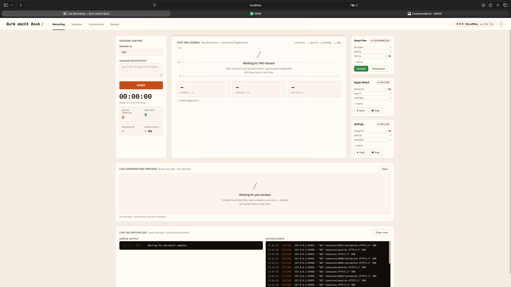

# Writing Activity Detection via Apple Watch IMU

[](https://github.com/noahsa16/ML4SCS_Burk_macht_Bock/actions/workflows/test.yml)

**Semester project · Machine Learning for Smart and Connected Systems**  
Team: Noah Samel · Ben Kriegsmann · Tajuddin Snasni

---

## Research Question

> Can writing activity be detected from IMU data (accelerometer + gyroscope) of an Apple Watch?

The Moleskine Smart Pen is used as ground truth during data collection — its stroke events tell us when the wearer is actually writing, which lets us label the watch samples. Once the model is trained the pen is no longer needed; inference runs on the watch alone, which is the whole point of the project. A live deployment of the model is wired into the dashboard (Focus Tracker + topbar pill).

---

## How it works

```
Apple Watch (IMU)
  └─ WatchConnectivity ──► iPhone Bridge ──► POST /watch    ──► server.py
                                                                     │
AirPods (head-IMU)                                                   │
  └─ CMHeadphoneMotionManager ─► iPhone ──► POST /airpods ──► server.py
                                                                     │
Moleskine Smart Pen (BLE)                                            │
  └─ pen_logger.py ──────────────────────────────────────────────────┘
                                                                     │
                                            data/raw/watch/{session}_watch.csv
                                            data/raw/pen/{session}_pen.csv
                                            data/raw/airpods/{session}_airpods.csv
                                                                     │
                                  src/alignment/pen_match.py   (recover δ)
                                  src/merge/                   (watch-base, ±40 ms)
                                                                     │
                                  data/processed/{session}_merged.csv
                                                                     │
                                  src/features/   (1 s windows, 0.5 s stride,
                                                   88 features + label smoothing:
                                                   time-stats + spectral (FFT) +
                                                   jerk + ZCR + correlations)
                                                                     │
                                  data/processed/{session}_windows.csv
                                                                     │
                                  src/training/train_loso.py      (per-session z-score
                                                                   → LOSO cross-val —
                                                                   headline metric)
                                                                     │
                                  models/rf_all.joblib            (LOSO artefact)
                                  models/rf_all_live.joblib       (deploy: pooled μ/σ)
                                  models/rf_noah.joblib           (Personal, 100 Hz)
                                                                     │
                                  src/server/inference.py         (live @1 Hz → dashboard
                                                                   topbar pill + Focus tab)
```

---

## Screenshots

### Dashboard (Web)

The session dashboard runs at `http://localhost:8000` and gives a real-time view of both sensors, session management, and data quality.

**Session overview & live sensor status**



---

### iPhone App

The iPhone app bridges Watch ↔ Server: it receives IMU batches via WatchConnectivity and forwards them as HTTP POSTs. It also relays start/stop commands from the server to the Watch.


---

### Apple Watch App

The Watch app captures `CMDeviceMotion` at 50 Hz and streams batches of 10 samples to the iPhone bridge via WatchConnectivity. The UI shows session state, sample rate, and connection status.


## Hardware

| Device | Role | Data |
|--------|------|------|
| Apple Watch (Series 7) | Model input | Accelerometer + Gyroscope @ 50 or 100 Hz (configurable) |
| AirPods (Pro / 3rd Gen) | Auxiliary input | Head IMU (accel + gyro + attitude) via `CMHeadphoneMotionManager` |
| Moleskine Smart Pen NWP-F130 | Ground truth | x/y/pressure/dot_type via BLE |

---

## Project Structure

```
server.py / pen_logger.py    FastAPI entry point + standalone BLE pen logger
src/server/                  Modular server (config, state, csv_io, quality,
                             routes/, study.py — Study Mode runner)
src/alignment/               Pen↔IMU clock-offset recovery (stroke-variance)
src/merge/                   Watch-base merge (1 row per IMU sample + label)
src/features/                Sliding windows → 88 features (94 with gravity)
src/training/                train_loso.py (headline) + within_session/ + deep/
src/evaluation/              Regression (Schreib-Prozent) + engagement post-proc
scripts/plots/, scripts/ml/  Figures + training/ablation/diagnostic scripts
scripts/ops/                 Server + tunnel shell helpers
tests/                       252 smoke tests (~7 s)
static/, dashboard.html      Web dashboard (page-modular ES modules)
watch_streamer/              iOS + watchOS Xcode targets
data/raw/, data/processed/   Per-session CSVs (raw committed, processed gitignored)
study_protocols/             Study Mode protocol definitions (v1.json)
```

See [CLAUDE.md](CLAUDE.md) for the per-module breakdown.

---

## Setup

```bash
pip install -r requirements.txt
```

---

## Running the Stack

**1. Start the server:**
```bash
uvicorn server:app --host 0.0.0.0 --port 8000
```
Open `http://localhost:8000` — the dashboard loads automatically.

**2. Open the iPhone app** — enter the server IP, tap *Connect*.

**3. Start a session** from the dashboard — both pen logger and watch start automatically. Two modes are available:

- **Free mode** (default): START, write freely, STOP. Same flow as before.
- **Study mode**: toggle the Recording page to **Study Mode** → pick `v1` from the protocol dropdown → **START STUDY**. The proband side enters a fullscreen takeover with per-task instructions, a pre-task countdown, an urgent last-5-second pulse, and audio cues (880 Hz tick + E5/B5 chime at transitions). The VL controls Pause / Next / Abort and can monitor live status from a second screen via the hidden `#admin` page — **triple-click the brand logo** to reach it on iPad. Task order is counterbalanced via a Latin Square keyed on `subject_index`.

**4. Record data** — write something, pause, write again (or follow the protocol).

**5. Stop the session** — CSVs are finalized. Study Mode also writes `data/raw/markers/{session}_markers.csv` with one row per task transition.

**6. Check quality** — dashboard Sessions page shows `ml_readiness` and `recording_health` per session. The **⤓ md** link in each row downloads a self-explaining Markdown report listing every issue with its check, threshold, observed value, and rationale (`GET /sessions/{id}/report?format=md`).

Server logs go to the terminal *and* `logs/server.log` (rotating). The same log lines also show up in the dashboard's event log panel — useful when debugging connection drops or rate spikes.

---

## ML Pipeline

Once a session is recorded, the per-session preprocessing is two commands:

```bash
python -m src.merge S029                       # watch-base merge → data/processed/S029_merged.csv
python -m src.features S029 --max-gap-ms 2500  # sliding windows  → data/processed/S029_windows.csv
```

Without a session ID, `merge` and `features` operate on the most recent session.

There are two training entry points, and we use them for different things.

### Cross-subject evaluation (this is what we report)

```bash
python -m src.training.train_loso --by person      # true LOSO-by-person — what we report
python -m src.training.train_loso --by session     # leave-one-session-out fallback
```

Each fold holds out one subject completely, so the held-out data is never seen during training. By default the script only includes sessions marked `verdict ∈ {trainable, usable}` (use `--include-all` to override).

**Current 10-subject LOSO** with RandomForest + per-session z-score + label closing `max_gap_ms=2500`:

| Decision window | Accuracy | ROC-AUC |
|---|---|---|
| 1 s (per window) | **0.863 ± 0.032** | **0.935 ± 0.032** — F1(writing) 0.875 |
| 5 s (burst-agg) | 0.902 ± 0.035 | 0.968 ± 0.030 |
| 10 s (burst-agg) | 0.885 ± 0.037 | 0.957 ± 0.025 |
| 30 s (burst-agg) | 0.844 ± 0.034 | 0.922 ± 0.029 |

The 1-s window is right for *features* (FFT bands, label transitions) but not for an app — a writing-time tracker cares about "has the person written in the last 30 s?", so we report the same fold at 1/5/10/30 s by smoothing the 1-s probabilities per session and re-thresholding at 0.5.

**Per-session z-score** (on by default) standardises each feature per `session_id` before fitting — removes the absolute-scale drift between wrists (size, handedness, strap tightness). Biggest single ML-side win of the project. Caveat: a model trained with z-score needs a calibration phase to be served on raw live features — see `models/rf_all_live.joblib` for the deployment variant with pooled μ/σ baked in.

**Label closing (`max_gap_ms=2500`)** redefines the label from "pen currently on paper" to "person in writing mode incl. micro-pauses ≤ 2.5 s". Gap sweep `300 → 2500` was the largest single-step gain of the project (acc +4.2 pp at N=5; tightened 6/7 folds at N=7; plateau-stable at N=10). `3000` regressed P05 — `2500` is the last "no systematic regression" step.

**Deep models.** `python -m src.training.deep` runs 1D-CNN / LSTM / GRU on raw 50-Hz IMU sequences under the same LOSO-by-person protocol. RF on engineered features is still the headline; deep models have not caught up at this dataset size.

### Within-session baseline (for iterating)

```bash
python -m src.training.within_session.train_rf S029
```

Temporal 80/20 split on a single session, 4-window gap to avoid leakage. **Not a generalisation claim** — used only for feature-iteration and label-smoothing tuning. Real numbers come from `train_loso.py`.

```bash
pytest tests/     # 252 cases, ~7 s
```

---

## Data Formats

The two files that actually feed the model:

- **`data/processed/{session}_merged.csv`** — watch-base: one row per IMU sample + `label_writing ∈ {0, 1}` from the nearest pen `dot_type` within ±40 ms of the δ-corrected pen clock. Watch samples in pen-gaps → label 0.
- **`data/processed/{session}_windows.csv`** — one row per 1 s sliding window (0.5 s stride) with 88 features (time-stats + spectral + jerk + ZCR + correlations), plus `label` and `t_center_ms`. Labels are morphologically closed (default `max_gap_ms=2500`) at sample level before windowing. Sessions captured with gravity (since 2026-05-26) get 6 extra features → 94 total — see [Pool architecture](#pool-architecture-legacy-vs-modern).

Raw CSV schemas (watch, pen, AirPods, sessions index, Study-Mode markers) are documented in [CLAUDE.md](CLAUDE.md).

---

## Pen ↔ IMU Time Alignment

The pen and the watch don't share a clock. The Moleskine pen's hardware clock is typically off by about 922 days plus some time-of-day offset, so a naïve wall-clock join would smear the labels by hundreds of milliseconds or worse — which would make the whole project pointless.

We recover the per-session offset **δ** automatically with a stroke-window variance-minimisation approach, ported from the TH Zürich method described in [`data/02_Pen_IMU_Timestamp_Alignment.pdf`](data/02_Pen_IMU_Timestamp_Alignment.pdf). The implementation is in [`src/alignment/pen_match.py`](src/alignment/pen_match.py).

The idea: while the pen is touching paper, the wrist holding the watch stays comparatively still — strokes are short and the motion is constrained. So the correct δ shifts the stroke mask onto the calmest parts of the IMU signal, and we can find it by minimising the mean accelerometer variance under the shifted mask.

```
                δ wrong                                δ correct
       ┌────────────────────┐                  ┌────────────────────┐
 acc   │   ╱╲   ╱╲    ╱╲    │            acc   │       ___      __  │
 var   │  ╱  ╲ ╱  ╲  ╱  ╲   │            var   │ ___ ╱   ╲ ___ ╱  ╲ │
       │ ╱    V    ╲╱    ╲  │                  │╱   ╲    │   ╲    │ │
       └─▲─────▲────▲─────▲─┘                  └─▲────▲────▲────▲──┘
         strokes overlap motion                  strokes sit on quiet IMU
```

The search runs in two passes: a coarse one (±20 s in 0.5 s steps) handles BLE buffering and clock drift, then a fine one (±5 s in 10 ms steps) refines around the coarse minimum. We report the confidence as `sigma_minimal_variance` — a z-score of the minimum against the rest of the search grid. More negative means a clearer alignment.

`merge_watch_pen()` calls `match_pen_data()`, shifts `pen.local_ts_ms` by δ, then runs a watch-based `merge_asof` within ±40 ms. Every watch sample is preserved and gets `label_writing = 1` if the nearest pen `dot_type` is `PEN_DOWN` or `PEN_MOVE` within tolerance, else `0`. If the signal is too weak (`sigma > -2`) we skip the δ shift and the quality engine flags the session as `low_sync_confidence` (warn) or `sync_failed` (bad). For actual training we apply a stricter filter of `σ ≤ -3` — we noticed that values around -2 sometimes lock onto spurious local minima.

This replaced an earlier idea to require a tap-sync protocol at the start of each recording (3× tap with the watch hand). We're glad we didn't go that route — alignment is now fully post-hoc and probands don't have to do anything special.

---

## Quality Checks

Each session is scored against a fixed set of checks defined in `quality.py`. Every issue carries `code`, `check`, `threshold`, `observed`, and a short `rationale` — so when a warning fires it's clear *why* and what assumption the threshold reflects. That came in handy: the first version of these checks had three thresholds set wrong, and we only noticed when we could actually read why each one was warning.

| Check | Target |
|-------|--------|
| Watch has accelerometer (`ax/ay/az`) | Required |
| Watch has gyroscope (`rx/ry/rz`) | Required |
| Watch sample rate | 40–60 Hz or 80–120 Hz (target: 50 or 100 Hz) |
| Pen CSV has `local_ts_ms` | Required for wall-clock anchor |
| No sequence gaps in watch batches | Recommended |
| Pen dots fall within watch time range | ≥ 80 % |
| `PEN_DOWN` / `PEN_UP` paired | Diagnostic |

Two scores are exposed separately: `ml_readiness` (does this session contain usable training material?) and `recording_health` (did the hardware behave during capture?). Sync confidence is reported as a diagnostic only and never downgrades a session score on its own.

The full per-session report is available as JSON at `GET /sessions/{id}/report` or as Markdown at `GET /sessions/{id}/report?format=md`.

Sync confidence (`sigma_minimal_variance`) is reported as a diagnostic alongside the scores. The pen↔IMU clock offset itself is recovered automatically per session — see [Pen ↔ IMU Time Alignment](#pen--imu-time-alignment) above.

---

## Current Status

The full pipeline is operational end-to-end: capture → alignment → merge → features → training → evaluation → **live inference in the dashboard**. **Headline: 10-subject cross-subject LOSO with RandomForest + per-session z-score + `max_gap_ms=2500` — accuracy 0.863 ± 0.032, ROC-AUC 0.935 ± 0.032, F1(writing) 0.875.** Burst @5s: AUC 0.968; @30s: AUC 0.922. Detailed progression and model-comparison panel in [`reports/model_progression.md`](reports/model_progression.md).

**Live deployment.** Inference runs in the server every 1 s (`src/server/inference.py`). The dashboard shows it as a topbar pill, a Recording-page card with sparkline, and a dedicated **Focus** tab with daily/weekly aggregation persisted across restarts. A model picker switches between Personal (`rf_noah`, 100 Hz, no z-score) and Generic (`rf_all_live`, pooled μ/σ baked in for raw-stream use).

**Pool architecture (Legacy vs Modern).** Sessions before 2026-05-26 stream 6 channels (`ax/ay/az + rx/ry/rz`); newer sessions add `motion.gravity` separately for 9 channels → 6 extra gravity features (94 total). Pool is auto-detected at runtime; `train_loso.py --pool {legacy,modern,auto}` selects which to train on. `src/features/downsample.py` bridges modern sessions into the legacy pool for cross-pool LOSO.

---

## Weekly Reports

- [Week 3](reports/week03.md)
- [Week 4](reports/week_04_report.md)
- [Week 5](reports/week_05_report.md)
- [Week 6](reports/week_06_report.md)
