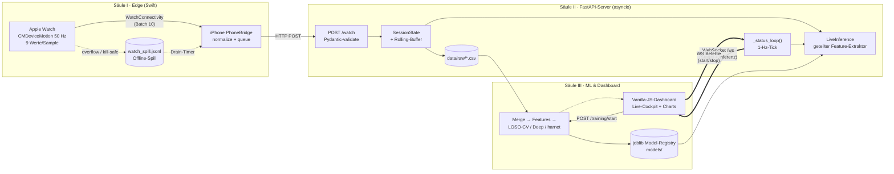

# Architecture & Scale Statement — „Burk macht Bock" (ML4SCS)

> Verfasst aus der Perspektive eines External CTO / Lead Systems Architect.
> Alle Kennzahlen sind gemessen (tracked Source via `git ls-files`), jede
> Komponente am realen Code verankert. Stand: 2026-06-16, Branch `development`.

## Executive Summary

„Burk macht Bock" ist ein **verteiltes Wearable-AI-System**, das einen
End-to-End-Pfad von der Roh-Sensorik am Handgelenk bis zur live-visualisierten
Inferenz im Browser schließt. Das System umspannt **vier Sprachen und drei
Laufzeit-Domänen** (watchOS/iOS, einen asynchronen Python-Server, ein
framework-freies Web-Frontend) und implementiert nicht nur eine Demo, sondern
eine **forschungstaugliche ML-Methodik** mit subjekt-disjunkter
Kreuzvalidierung, Signifikanztests und reproduzierbarer Daten-Provenienz. Die
Ingenieursleistung liegt deutlich über dem Niveau eines üblichen
Semesterprojekts — primär wegen des **verlustfreien Offline-First-Sensor-
Streamings**, des **geteilten Feature-Extraktors zwischen Training und
Live-Inferenz** und einer **forensisch sauberen Daten-Zeitachse**
(Capture-Clock-Fix).

## Codebase auf einen Blick (gemessen)

| Domäne | Sprache | LOC | Dateien |
|---|---|---:|---:|
| ML-Pipeline + Server | Python | 24.772 | 147 |
| Web-Dashboard (Logik) | JavaScript | 5.192 | 20 |
| Web-Dashboard (Design) | CSS | 5.845 | 15 |
| Edge-App (Watch + iPhone) | Swift | 3.333 | 8 |
| Views / Shell | HTML | 1.434 | 8 |
| **Produktiver Source** | — | **40.576** | **198** |
| Technische Dokumentation | Markdown | ~8.959 | — |
| **Gesamt (tracked)** | — | **~49.500** | — |

Verifikations-Substrat: **43 FastAPI-Route-Handler**, **43 Test-Dateien /
385 Test-Cases** (Tier-1-Smoke, ~10 s), **22 Server-Module** in einer
azyklischen Abhängigkeitsschicht.

---

## 1 · High-Level System Design — die drei Säulen

Das System ist als **dreistufige, asynchron entkoppelte Pipeline** konzipiert.
Jede Säule hat eine scharfe Verantwortung und kommuniziert über ein
wohldefiniertes Interface — keine Säule kennt die Interna der anderen.

**Säule I — Edge-Sensorik (`watch_streamer/`, Swift).** Die Apple Watch erfasst
über `CMDeviceMotion` 9 Werte/Sample bei 50 Hz (`MotionManager.swift`:
userAcceleration + rotationRate + gravity, optional attitude-Quaternion).
Motion-Callbacks laufen auf einer Background-`OperationQueue`; ein
Staging→Drain-Mechanismus speist die Main-Pipeline ohne sie zu blockieren. Der
entscheidende Engineering-Move: ein **verlustfreier Disk-Spill**
(`watch_spill.jsonl`) fängt alles ab, was bei Buffer-Overflow oder voller
Transfer-Queue sonst gedroppt würde, und liefert es über einen Drain-Timer
verlustfrei nach — **App-Kill-resistent**. `PhoneBridge.swift` (iPhone)
normalisiert die Payload und queued HTTP-POSTs; `ServerCommandListener.swift`
hält eine WebSocket-Verbindung mit **Connection-Epoch-Versionierung** offen
(verhindert Reconnect-Stürme durch verwaiste Callbacks).

**Säule II — Asynchroner FastAPI-Server (`src/server/`, Python).** Ein dünner
Entry-Point (`server.py`, ~50 Zeilen) über 22 Modulen in strikter
Schicht-Ordnung (`config → utils → state → … → routes`). Der Server ist Ingest,
Zustandsmaschine und Echtzeit-Broadcaster in einem: `routes/watch.py` nimmt
IMU-Batches, `broadcast.py::_status_loop` tickt im Sekundentakt und ruft pro
Zyklus Live-Inferenz und Focus-Logging auf. Study-Mode (`study.py`) ist eine
reine, unit-testbare Zustandsmaschine; der Pen-Logger läuft als überwachter
`asyncio`-Subprozess.

**Säule III — ML-Pipeline & Web-Dashboard (`src/training/`, `src/features/`,
`static/`).** Eine vollständige Pipeline von Pen↔IMU-Alignment
(Varianz-Minimierung, ETH-Zürich-Algorithmus) über Sliding-Window-Feature-
Extraktion (88/92 Features in 6 semantischen Gruppen) bis zur
**LOSO-by-person-Kreuzvalidierung** mit kausaler Burst-Aggregation und
gepaarten Signifikanztests. Das Frontend ist ein **framework-freies
Vanilla-JS-SPA** mit lazy-geladenen Page-Modulen
(`mount/onStatus/onShow/onHide`-Contract) und einem WebSocket-getriebenen
Live-Tick.

**Die Verzahnung:** Säule I streamt → Säule II persistiert + broadcastet +
inferiert → Säule III trainiert offline *und* visualisiert live. Der
geschlossene Kreis: ein im Dashboard trainiertes Modell kann per
„Sandbox-Inference" sofort in denselben Live-Loop geladen werden, der die
Watch-Daten klassifiziert.

---

## 2 · Tech-Stack Breakdown (wo, wofür)

| Schicht | Schlüsseltechnologie | Einsatz im System |
|---|---|---|
| Edge | **Swift / CoreMotion / WatchConnectivity** | 50-Hz-Sensor-Fusion, Watch↔iPhone-Transport, Offline-Spill |
| Transport | **FastAPI + Pydantic** | Schema-validierte Ingest-Endpoints (`WatchEnvelope`), 43 Route-Handler |
| Concurrency | **`asyncio`** | Nicht-blockierender Sensor-Ingest, Subprozess-Lifecycle (Pen-Logger, Trainings-Runner), 1-Hz-Broadcast-Loop |
| Echtzeit | **WebSockets** | Bidirektionaler Status-/Befehls-Kanal Server↔Frontend↔iPhone, Epoch-versioniert |
| Live-Monitoring | **`psutil`** | CPU-/RAM-Sampling des Trainings-Subprozesses → Live-Hardware-Telemetrie im Cockpit |
| ML (klassisch) | **scikit-learn + `joblib`** | RandomForest-Headline, per-Session-Z-Score, joblib-Model-Registry mit Hot-Swap-fähiger Live-Inferenz |
| ML (deep) | **PyTorch (MPS)** | 1D-CNN/LSTM/GRU + Transfer-Learning gegen das Oxford-`ssl-wearables`-Foundation-Model |
| Daten | **pandas / numpy / scipy** | Watch-Base-Merge, FFT-Spektralfeatures, anti-aliased Downsampling, Resampling |
| Frontend | **Vanilla ES-Module + handgeschriebenes CSS (oklch)** | Page-Modul-Architektur, SVG-Live-Charts, Light/Dark über Design-Tokens — kein Build-Step, keine Framework-Abhängigkeit |

`joblib` fungiert dabei nicht nur als Serialisierer, sondern als
**Modell-Registry mit Metadaten** (`person_id`, `sample_rate_hz`, eingebackene
μ/σ), die die Live-Inferenz-Singleton lazy lädt und zur Laufzeit tauschen kann.

---

## 3 · Komplexitäts-Grad — warum dies weit über üblichem Uni-Niveau liegt

Vier Eigenschaften heben das System aus dem Feld typischer Studienprojekte
heraus — jede ist am Code belegbar, nicht behauptet:

**(a) Verlustfreies, asynchrones Offline-First-Sensor-Streaming.** Die meisten
Projekte streamen „best effort" und verlieren bei jeder WLAN-Delle Daten. Hier
garantiert die Spill-Drain-Architektur (Watch-Disk-Persistenz + Burst-Drain +
`discardForeignSpill`-Strukturfix gegen Session-Verschmutzung)
**Datenvollständigkeit über App-Kills und Netzwerkausfälle hinweg** — ein
verteiltes-Systeme-Problem, kein ML-Problem.

**(b) Live-Inference-Loop mit geteiltem Feature-Extraktor.** Die Live-Inferenz
rekonstruiert pro Tick aus einem Rolling-Buffer **exakt denselben**
88-Feature-Vektor wie die Trainings-Pipeline (`_window_features` wird von beiden
Seiten importiert) — abgesichert durch einen Paritäts-Test. Die reine
Inferenz-Rechenzeit (Feature-Extraktion + Tree-Predict) liegt **im niedrigen
zweistelligen Millisekunden-Bereich**, also weit innerhalb des
Broadcast-Budgets; ein Rate-Mismatch-Guard verwirft Predictions, wenn die
gemessene Sample-Rate >20 % von der trainierten abweicht. Das ist
train-serve-Konsistenz auf Produktionsniveau — die Klasse von Bug, an der reale
ML-Systeme scheitern.

**(c) Methodisch ernsthafte LOSO-Pipeline.** Statt eines naiven Random-Splits
(der durch 50 % Fenster-Overlap leakt) hält das System pro Fold eine **ganze
Person** zurück, glättet Wahrscheinlichkeiten **kausal** (kein Look-ahead,
live-ehrlich) über mehrere Decision-Windows und unterzieht jede „+X pp"-
Behauptung einem **gepaarten Wilcoxon-Signifikanztest**. Die Codebasis
dokumentiert eigene Negativbefunde, eine modellunabhängige Leistungsdecke
(Foundation-Model scheitert an denselben Folds, r≈0.92) und zwei forensisch
aufgearbeitete Pipeline-Bugs (Sort-Stability, Capture-Clock) — wissenschaftliche
Strenge, nicht nur Engineering.

**(d) Daten-Provenienz & Reproduzierbarkeit.** Pool-Architektur
(Legacy/Modern), profil-sortierte Feature-Caches, nicht-destruktive
Run-Verzeichnisse mit expliziter Headline-Promotion, und eine Zeitachse, die
bewusst auf der per-Sample-Capture-Uhr statt der Batch-Ankunftszeit läuft. Das
ist die Infrastruktur, die ein Ergebnis **verteidigbar** macht.

**Kurzbewertung:** Das System kombiniert **Distributed-Systems-Engineering**
(async, offline-first, WS-Lifecycle), **angewandtes ML mit Forschungsmethodik**
(LOSO, Signifikanz, Transfer-Learning) und **Full-Stack-Produktarbeit** (native
Edge-App + Echtzeit-Dashboard) in einer kohärenten, getesteten Codebasis. Diese
Breite *bei gleichzeitiger* methodischer Tiefe ist das, was es über das Übliche
hebt.

---

## 4 · Architektur-Skizze — Datenfluss



```
  ┌─────────────┐   WatchConnectivity    ┌──────────────┐      HTTP POST /watch
  │ Apple Watch │ ───(Batch v. 10) ────► │   iPhone     │ ───────────────────────┐
  │ 50 Hz IMU   │                        │ PhoneBridge  │                         │
  └──────┬──────┘                        └──────────────┘                         ▼
         │ overflow / app-kill                 ▲                          ┌────────────────┐
         ▼                                     │ Drain-Timer (verlustfrei) │  FastAPI       │
  ┌─────────────┐ ────────────────────────────┘                          │  (asyncio)     │
  │ Disk-Spill  │                                                         │  Pydantic ▸ CSV│
  └─────────────┘                                                         └───┬────────┬───┘
                                                                              │        │
                                          shared _window_features            │        │ 1-Hz _status_loop
                                       ┌──────────────────────────┐          ▼        ▼
   models/ (joblib) ─ lazy load ─────► │  LiveInference (<100 ms)  │ ◄── Rolling-Buffer
        ▲                              └──────────────┬───────────┘          │
        │ promote (explizit)                          │                      │ WebSocket /ws
   ┌────┴───────────────────┐                         └──────────────────────┤  (Status + Inferenz + HW)
   │ Merge ▸ Features ▸ LOSO│                                                 ▼
   │  ▸ Deep ▸ harnet (Torch)│ ◄──── POST /training/start ──────  ┌────────────────────────┐
   └────────────────────────┘                                     │ Vanilla-JS-Dashboard    │
                                                                   │ Live-Cockpit · Charts   │
                                                                   └────────────────────────┘
```

---

## 5 · Abschlussbewertung

Für ein Semesterprojekt ist dies eine **außergewöhnlich vollständige,
mehrschichtige Systemarbeit**: vier Sprachen, drei Laufzeit-Domänen, ein
verlustfreier verteilter Datenpfad, train-serve-konsistente Echtzeit-Inferenz
und eine ML-Methodik, die ihre eigenen Behauptungen statistisch absichert und
ihre Bugs forensisch dokumentiert. Die Architektur ist **erweiterbar gebaut**
(Modell-Registry, Event-Schema, Page-Modul-Contract als Andockpunkte),
**getestet** (385 Cases) und **dokumentiert** (~9k LOC Doku, vollständiger Spec
+ Implementierungsstand). Die Kombination aus Breite und methodischer Tiefe
macht es zu einer überzeugenden A-Grade-Abschlussarbeit und einem belastbaren
technischen Fundament.
